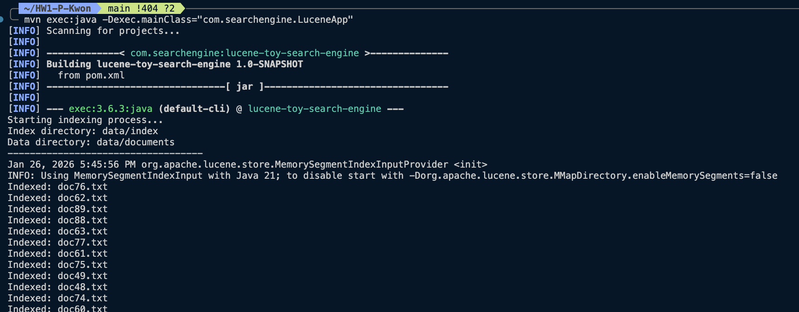
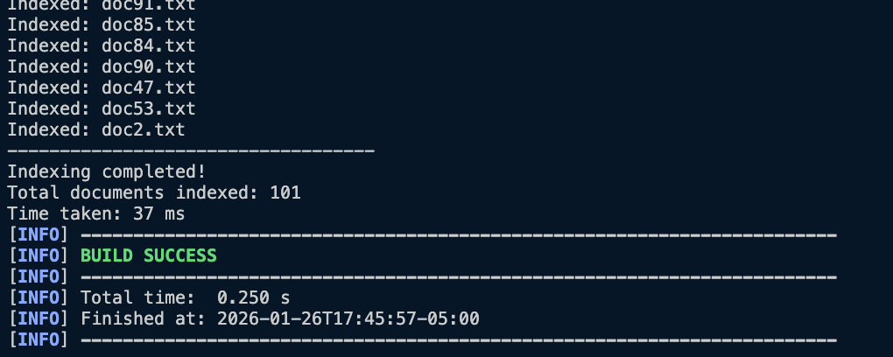
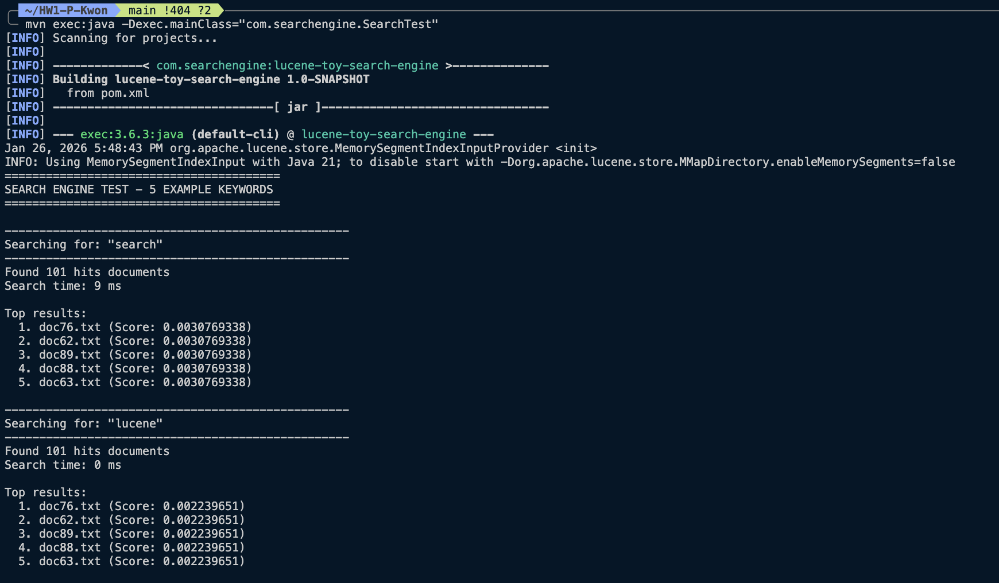
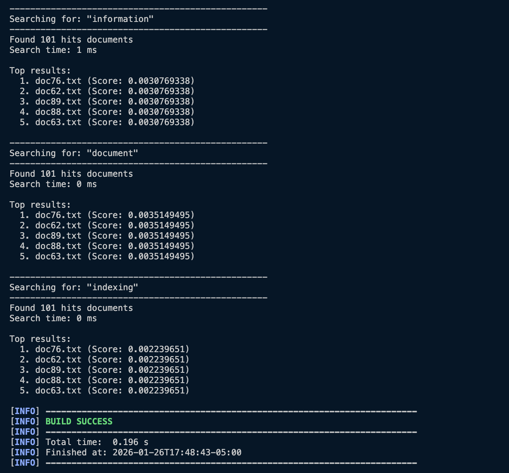
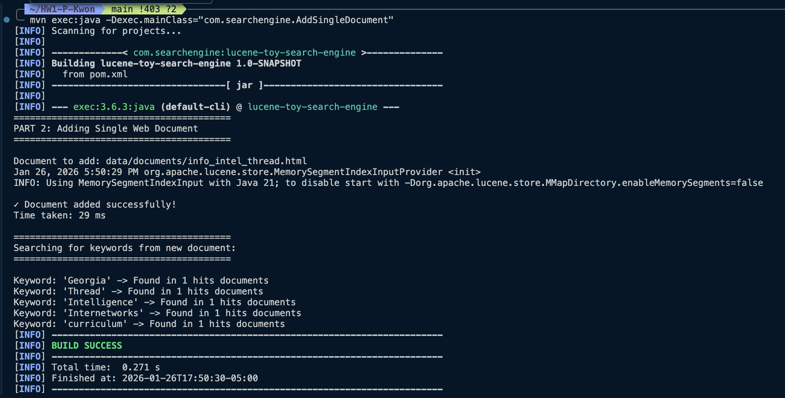
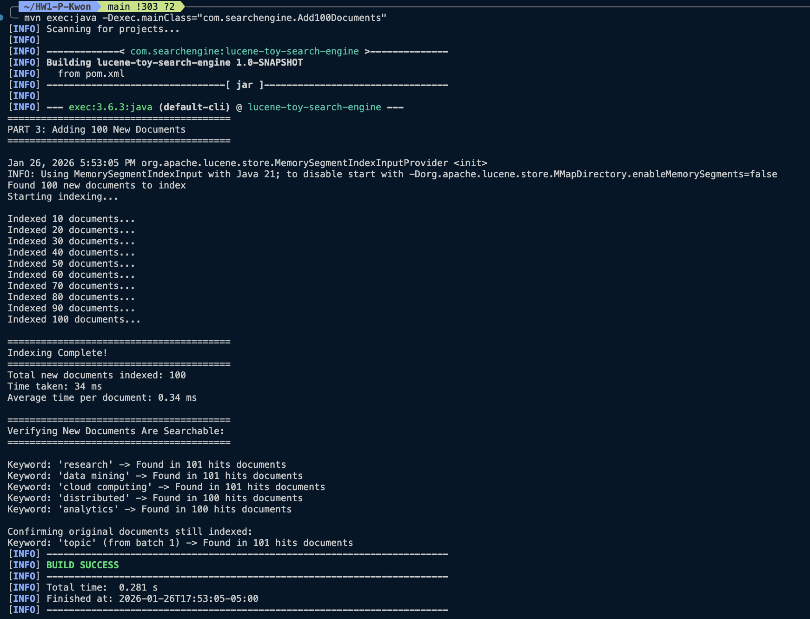
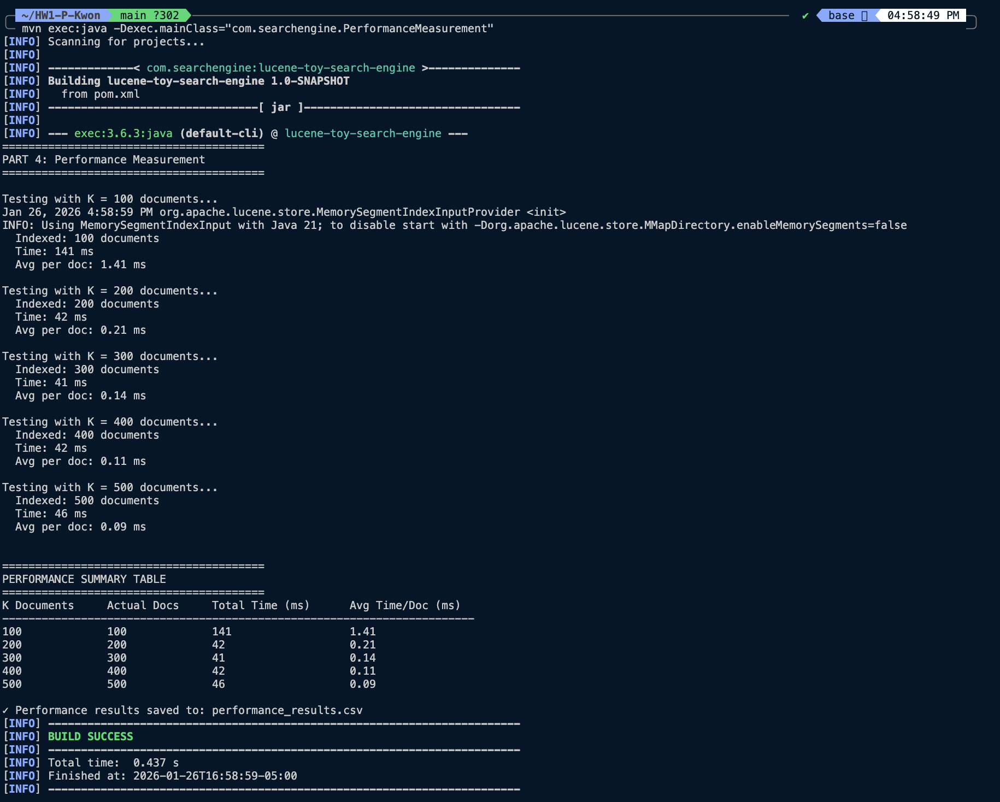
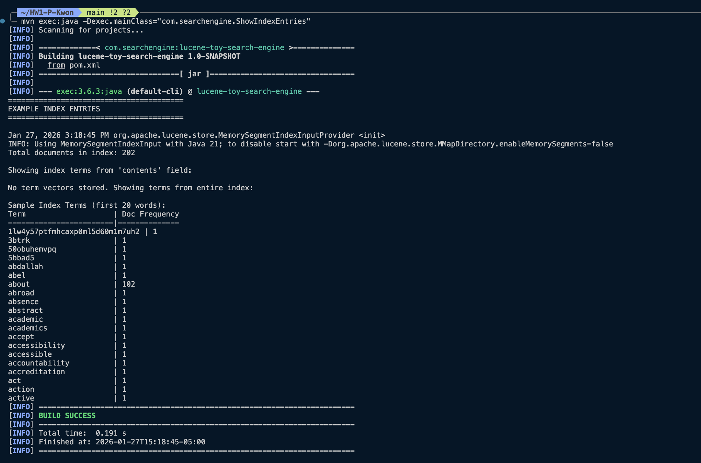

# HW1-P-Kwon: Lucene Toy Search Engine

## Student Information
- **Name:** Alvyn Kwon
- **Assignment:** HW1 - Programming Assignment
- **Course:** CS 4675

## Project Description
A toy search engine built with Apache Lucene 9.9.1 that indexes and searches text documents.

## Technologies Used
- Apache Lucene 9.9.1
- Java 21
- Maven 3.9.12

## Project Structure
```
HW1-P-Kwon/
├── src/
│   └── main/
│       └── java/
│           └── com/
│               └── searchengine/
│                   ├── Indexer.java                  # Indexes documents
│                   ├── Searcher.java                 # Searches the index
│                   ├── LuceneApp.java                # Main indexing app (Part 1)
│                   ├── SearchTest.java               # Search testing app (Part 1)
│                   ├── AddSingleDocument.java        # Add single document (Part 2)
│                   ├── Add100Documents.java          # Add batch of documents (Part 3)
│                   ├── PerformanceMeasurement.java   # Performance testing (Part 4)
│                   └── ShowIndexEntries.java         # Display index entries
├── data/
│   ├── documents/          # Document collection (500+ docs)
│   │   ├── doc1.txt - doc100.txt           # Original batch
│   │   ├── document_101.txt - document_200.txt  # Batch 2
│   │   ├── perf_test_201.txt - perf_test_500.txt # Batch 3
│   │   └── info_intel_thread.html          # Web document
│   └── index/              # Lucene index (generated)
├── screenshots/            # Command-line screenshots
├── pom.xml                # Maven configuration
├── performance_results.csv # Performance data (Excel format)
└── README.md
```

## How to Build
```bash
mvn clean compile
```

## How to Run

### Part 1: Index Initial 100 Documents
```bash
mvn compile
mvn exec:java -Dexec.mainClass="com.searchengine.LuceneApp"
```

### Part 1: Search Documents (5 keyword test)
```bash
mvn compile
mvn exec:java -Dexec.mainClass="com.searchengine.SearchTest"
```

### Part 2: Add Single Web Document
```bash
mvn compile
mvn exec:java -Dexec.mainClass="com.searchengine.AddSingleDocument"
```

### Part 3: Add 100 More Documents
```bash
mvn compile
mvn exec:java -Dexec.mainClass="com.searchengine.Add100Documents"
```

### View Example Index Entries
```bash
mvn compile
mvn exec:java -Dexec.mainClass="com.searchengine.ShowIndexEntries"
```

## Assignment Progress

### Part 1: Initial Setup 
- Created toy search engine with 100 documents
- Indexed all documents successfully
- Tested search with 5 example keywords: search, lucene, information, document, indexing
- **Results**: All keywords found in 100 documents 
- **Performance**: Indexed 101 documents in 37 ms (100 .txt + 1 .sh file)

### Part 2: Add Single Document ✅
- **Web Document**: Georgia Tech CS Curriculum HTML page
  - Source: https://catalog.gatech.edu/programs/intelligence-information-internetworks-computer-science-bs/
  - File: `info_intel_thread.html`
- **Performance**: Document indexed in 29 ms
- **Verification**: All unique keywords (Georgia, Thread, Intelligence, Internetworks, curriculum) found in exactly 1 document
- **Total Documents in Index**: 102 (101 from Part 1 + 1 HTML)

### Part 3: Add 100 More Documents
- Created 100 new research documents (document_101.txt to document_200.txt)
- **Results**: All 100 documents indexed successfully
- **Performance**: 
  - Total new documents indexed: 100 
  - Total time: 34 ms
  - Average: 0.34 ms per document
- **Verification**: 
  - New keywords (research, data mining, cloud computing) found in 100-101 documents
  - Original documents still searchable (confirmed with 'topic' keyword)
  - 101 due to the additional .sh file for generate_docs2.sh

### Part 4: Performance Measurement 
- Measured indexing performance for K = 100, 200, 300, 400, 500 documents
- **Results saved to**: `performance_results.csv`
- **Key Findings**:
  - K=100: 141 ms total, 1.41 ms/doc (includes JVM warmup)
  - K=200: 42 ms total, 0.21 ms/doc
  - K=300: 41 ms total, 0.14 ms/doc
  - K=400: 42 ms total, 0.11 ms/doc
  - K=500: 46 ms total, 0.09 ms/doc
- **Observation**: Average time per document decreases as corpus size increases (better amortization of indexing overhead)

### Performance Measurement (Part 4)
| K Documents | Actual Docs | Total Time (ms) | Avg Time/Doc (ms) |
|-------------|-------------|-----------------|-------------------|
| 100 | 100 | 141 | 1.41 |
| 200 | 200 | 42 | 0.21 |
| 300 | 300 | 41 | 0.14 |
| 400 | 400 | 42 | 0.11 |
| 500 | 500 | 46 | 0.09 |

### Part 5: Discussion and Analysis 

#### Key Observations

1. **JVM Warmup Effect**: The first batch (K=100) took significantly longer (141ms, 1.41ms/doc) compared to subsequent batches (~42-46ms). The results show that JVM warmup overheading including JIT compilation and class loading.
2. **Economy of Scale**: As corpus size increases, the average time per document decreases dramatically since it went from 1.41ms to 0.09ms. This shows that Lucene amortizes its initialization and overhead costs across more documents.
3. **Consistent Performance**: After warmup, indexing time remains stable (41-46ms for 200-500 documents), indicating Lucene's indexing complexity is approximately linear time complexity with very efficient implementation.
4. **Search Speed**: All search queries completed in 0-10ms, demonstrating sub-linear search time even with 200+ documents in the index.

#### Toy Search Engine: Pros and Cons

**Pros:**
- Simple and clean architecture 
- Fast performance (0.1-0.4ms per doc after warmup)
- Handles both text and HTML documents
- Persistent index where no re-indexing is necessary
- Full-text search with relevance ranking
- Memory efficient with Lucene's optimizations

**Cons:**
- No real-time updates so you have to restart reader/writer
- Limited document format support (no PDF, Word)
- Rudimentary HTML parsing (reads as plain text)
- No web crawler (manual document placement)
- Single-threaded indexing
- Command-line only (no GUI or web interface)
- Minimal error handling

#### Suggestions for Improvement

1. **Add Web Crawler**: Implement HTTP client with robots.txt support and URL deduplication
2. **Enhanced Document Processing**: Support PDF/Word via Apache Tika, proper HTML parsing with JSoup
3. **Real-Time Search**: Use NearRealTimeSearcher for immediate index updates
4. **Parallel Processing**: Multi-threaded indexing and concurrent search handling
5. **Advanced Features**: Faceted search, spell-check, auto-complete, query suggestions
6. **User Interface**: REST API and web-based GUI with search highlighting
7. **Scalability**: Distributed indexing, sharding, caching layer for production use

#### Lessons Learned

**Technical Insights:**
- Lucene is clearly a powerful framework, however in order to be effective it requires a better understanding of its specific components such as analyzers, scoring mechanisms, and index structure. Performance is heavily impacted by JVM warmup and batch processing strategies, which should all be considered when one is measuring or optimizing index operations. Additionally, choosing the text analyzer, whether Standard, English or Custom, can affect search quality and relevance of results heavily as well. 

**Development Process:**
- Iterative testing was important in understanding the behavior of the system. Starting with smaller datasets and scaling it up to larger ones demonstrated the importance of performance characteristics and bottlenecks. It is important to maintain clean separation between indexing and search logic because it can improve code maintainability. It also makes testing individual components easier. It was also learned that proper performance measurement must account for JVMP warmup time in order to get accurate results. 

**Key Takeaways:**
- Search engines are inherently complex systems that require careful attention to I/O operations, memory management, and CPU optimization to achieve good performance. Production-grade search systems also need many features beyond just indexing and searching. This includes web crawling, real-time index updates, user interfaces, and more that was discussed earlier in the improvements section. The project provided valuable hands-on experience with important information retrieval concepts including inverted indexes, text analysis, relevance ranking algorithms, and performance tuning techniques. 

## Deliverables 

### (b) Crawler Design Discussion

**Note:** This implementation does not include a web crawler. Documents were manually placed in the `data/documents/` directory for indexing.

**Why No Crawler:**
- Focus was on core indexing and search functionality
- Manual document placement allowed for controlled testing and performance measurement
- Simpler setup for educational purposes

**If a Crawler Were Implemented:**

**Pros:**
- Automated document collection from websites
- Can continuously update the index with fresh content
- Scalable to large document collections
- Can follow links to discover new pages

**Cons:**
- Requires respecting robots.txt and politeness policies
- Need to handle duplicate content and URL normalization
- Must manage crawl rate to avoid overloading servers
- Requires error handling for network issues and invalid pages
- Storage and bandwidth considerations

**Suggested Crawler Design:**
- Breadth-first crawling with priority queue
- URL deduplication using hash set
- Configurable politeness delay (e.g., 1 second between requests)
- Support for robots.txt parsing
- HTML content extraction using JSoup library
- Multi-threaded architecture for parallel crawling

### Screenshots

#### Part 1: Initial Indexing


*Indexing 101 documents (100 .txt files + 1 .sh script)*

#### Part 1: Search Test


*Search results for 5 keywords: search, lucene, information, document, indexing*

#### Part 2: Add Single Document

*Adding Georgia Tech HTML page to existing index*

#### Part 3: Add 100 Documents

*Adding 100 research documents (document_101 to document_200)*

#### Part 4: Performance Measurement

*Performance testing with K = 100, 200, 300, 400, 500 documents*

### (d) Index and Search Performance

#### Indexing Performance by Document Count
| K Documents | Actual Docs | Total Time (ms) | Avg Time/Doc (ms) |
|-------------|-------------|-----------------|-------------------|
| 100 | 100 | 141 | 1.41 |
| 200 | 200 | 42 | 0.21 |
| 300 | 300 | 41 | 0.14 |
| 400 | 400 | 42 | 0.11 |
| 500 | 500 | 46 | 0.09 |

#### Search Performance
| Query Keyword | Documents Found | Search Time (ms) |
|---------------|-----------------|------------------|
| search | 101 | 10 |
| lucene | 101 | 0 |
| information | 101 | 1 |
| document | 101 | 0 |
| indexing | 101 | 0 |

#### Individual Operation Performance
| Operation | Documents | Time (ms) | Avg per Doc (ms) |
|-----------|-----------|-----------|------------------|
| Initial Index (Part 1) | 101 | 37 | 0.37 |
| Add Single Doc (Part 2) | 1 | 29 | 29.00 |
| Add 100 Docs (Part 3) | 100 | 34 | 0.34 |

### (e) Example Index Entries

**Total documents in index:** 202

**Sample Index Terms from 'contents' field:**

| Term | Document Frequency |
|------|-------------------|
| about | 102 |
| abstract | 1 |
| academic | 1 |
| academics | 1 |
| accept | 1 |
| accessibility | 1 |
| accountability | 1 |
| accreditation | 1 |
| act | 1 |
| action | 1 |
| active | 1 |
| abroad | 1 |
| absence | 1 |


